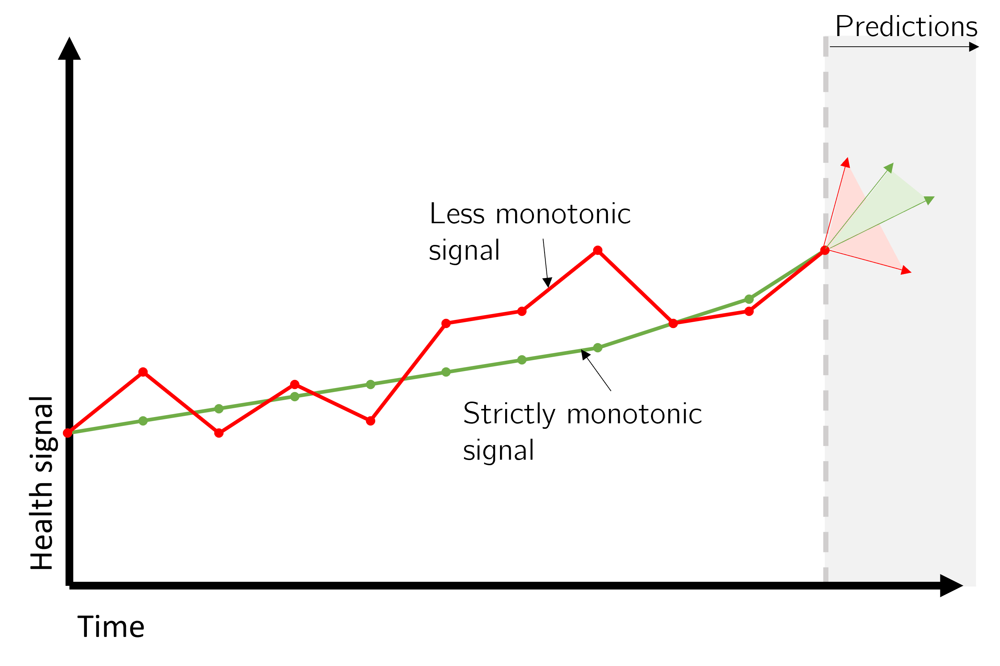
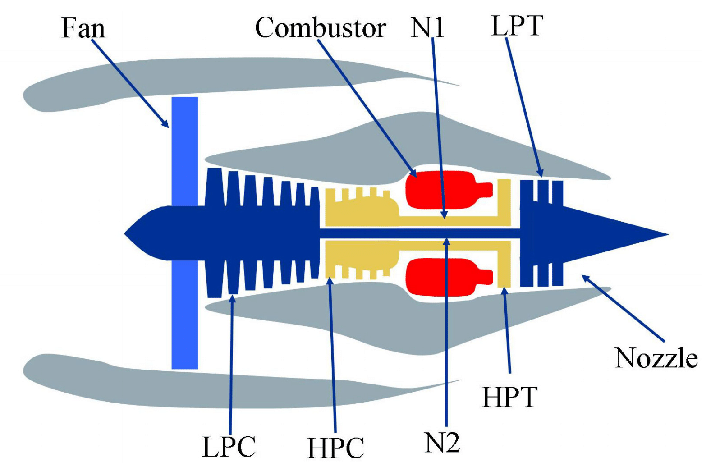
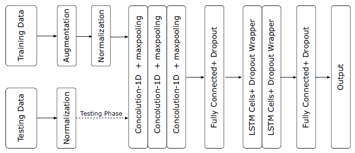

## Remaining Useful Life (RUL) Estimation based on Random Forest and CNN-LSTM 

Project that tests the influence of monotonic constraints on the estimation of a RF and CNN-LSTM Model for C-MAPSS


## Non-Monotonic constraints using Average Conditional Displacement (ACD)

In prognostics, monotonicity is a popular metric used to describe the increasing or decreasing tendency of the sensor data. Several authors have shown that increasing the monotonicity of the health monitoring trajectories makes it possible to aid the prognostics. Various algorithms have been applied to impose monotonic constraints on data for fault progression prognostics. In this paper, we explore the average conditional displacement, an algorithm that transforms non-monotonic trends into strict monotonic data using piece-wise linear curves. Notably, the method does not assume any functional form, and its accuracy matches other established techniques such as polynomial fitting or moving average. Also, it works well for time series with arbitrary stationary noise. Our work aims to determine to which extent the average conditional displacement can assist prognostics in estimating the remaining useful life. Two prognostics models with differing levels of complexity are utilized: the random forest and the CNN-LSTM model. These models are trained on the NASA simulated C-MAPSS dataset of a turbofan engine. Model performance is measured with different performance metrics. The results suggest that treating non-monotonic signals as a pre-processing step can improve the accuracy of the predictions. In both modeling cases, the results are better than the rolling mean, exponential moving average, and the direct use of raw data. The algorithm has, however, some limitations. It did not achieve high performance in the scoring function metric. Notably, the algorithm significantly outperformed the other methods in end-of-life predictions. 

<p float="center">
  
</p>

Uncertainties and inefficient sensors tend to disturb the monotonic behavior of signals and can result in erroneous estimates of the Remaining Useful Life (RUL) of the equipment. Capturing back these monotonic constraints can help promote better prognostics models. 

This repository provides code to estimate the RUL of the data of C-MAPSS dataset 1 using a CNN-LSTM network. The method works without the need to explicitly state the number of operating modes/regimes.   

There is a number of operational files that are important: 
```
sma_config : configure the best window size for the sma filter

datapreprocessing_generatedata: generate the csv files for each preprocessing method

datapreprocessing_plotresults: plot the curves after applying the different preprocessing methods

datapreprocessing_motonotonicitycalc: calculate the monotonicity of the data in PreprocessedData

randomforest_model: run the random forest model on the data

CNNLSTM_model: run the random forest model on the data and the LSTMCNN

```

## C-MAPSS

The Commercial Modular Aero-Propulsion System Simulation (C-MAPSS) was developed at the NASA Glenn Research Center. The simulator emulates a large, high-bypass ratio turbofan engine similar to the GE90. The model is composed of several modules, as shown below. Six different flight conditions were simulated based on three operational conditions: altitude (0-42K ft.), Mach number (0-0.84), and throttle resolver angle (20-100). The throttle resolver angle, or TRA, is the angular deflection of the pilot’s power lever, varying between 0 and 100%. The Mach number is the ratio of flow velocity to the speed of sound at the medium. Altitude relates to atmospheric conditions.

<p float="center">
  
</p>

The C-MAPSS data consists in a collection of time series of observables at cruise snapshots produced due to variation of the flow and efficiencies of the High Pressure Compressor (HPC) module from initial settings (nominal behavior) to failure values. Each degradation trajectory is characterized by series of observables (features) that include sensor and operational variables, that change over time from some nominal condition to failure. 

## CNN-LSTM

We use a deep learning approach for estimation of RUL based on a CNN combined with an LSTM. 
For more details, please see the original paper from other authors [Arxiv paper](https://arxiv.org/pdf/1810.05644.pdf).




## Libraries Used

Python

- [Python Standard Library](https://docs.python.org/2/library/): Built in python modules.
- [Numpy](https://numpy.org/): Scientific computing with python.
- [Scikit-image](https://scikit-image.org/): Scientific image tools. 
- [Pandas](https://pandas.pydata.org/): Data analysis tools.
- [Scikit-learn](https://scikit-learn.org/stable/): Machine learning toolkit.
- [MiniSom](https://pypi.org/project/MiniSom/): Minisom package. 

### Note

The code was developed for C-MAPSS datasets but it can be easily adapted to other applications. 

### Support or Contact

Having trouble with this repository? Contact me and we’ll help you sort it out.


